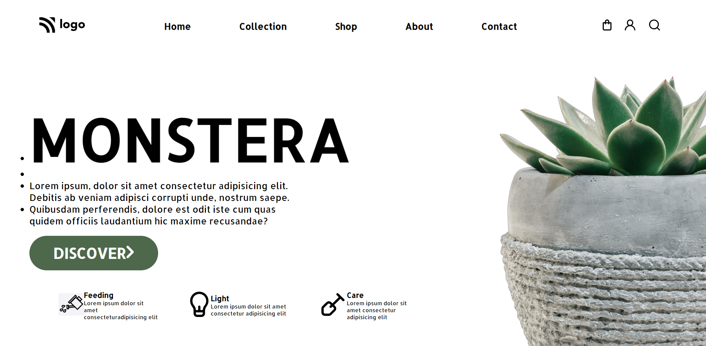

# MONSTERA PLANTS Web Page

## Project 06 🚀 Website's [Live Link](https://monsteraplants.netlify.app/)🔗

>by Arpit Pathak

Screenshot

## What I learned from this Project? 

- Learned to use CSS position (Absolute & Relative) properties.
- Learned about CSS `:nth-child()` selector
- Learned about Flexbox and its properties justify-content, align-items.
- Learned how to make bottom borders on hover over navigation links by using `:hover` and `::after` .

## Time taken to finish this project ⏳
- 4.5 hours
---

